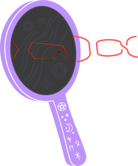
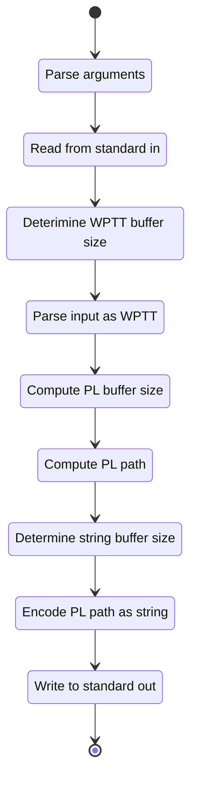

[](https://doi.org/10.5281/zenodo.19955234)
[](https://www.gnu.org/licenses/gpl-3.0)

[](https://brainmade.org)

{width=40%}

/// caption

///

## Note to Reader

### What Am I?

The _Identity Tangle Tree (ITT) to Piecewise Linear (PL) Path_ is a runnable wrapper for the
[Tanglenomicon Core Libraries](https://github.com/Uiowa-Applied-Topology/tanglenomicon_core_libraries).
Specifically, the ITT runnable takes command line input in the form of an ITT and output a PL path
realizing that ITT in $\R^3$.

### About the Documentation

The following document describes the "rules" and expectation for the ITT to PL Path tool. The
["Code Comments"](./lib/files/) page contains the technical context descriptions found in the source
files. The ["Decisions"](./madr/) page contains a collection of
[architectural decision records](https://adr.github.io/madr/) [@Kopp2018] giving context on why this
is the way it is.

### Issues

If you discover an issue with this repository or have a question, please feel free to open an issue.
I've included templates for the following issues:

- 🖋️ Spelling and Grammar: Found some language that is incorrect?
- 🤷 Clarity: Found a section that just makes no sense?
- ❓ Question: Do you have a general question?
- 🐞 Bug: Found an error in the code?
- 🚀 Enhancement: Have a suggestion for improving the toolchain?

[:fontawesome-solid-paper-plane: Open Issue!](https://github.com/Joecstarr/itt_2_plpath_converter/issues/new/choose){ .md-button }

## 📃 Cite Me

BibTeX and APA on the right sidebar of GitHub.

## ⚖️ License

GNU GPL v3

## Planning and Administration

### Tasks

Tasks are tracked as GitHub issues.

### Version Control

The toolchain shall be kept under Git versioning. Development shall take place on branches with
`main` on GitHub as a source of truth. GitHub pull requests shall serve as the arbiter for inclusion
on main with the following quality gates:

- Compiling of source code.
- Running and passing the unit test suite.
- Running and passing linting and style enforcers.
- Successful generation of documentation.

#### Release Tagging

The project shall be tagged when a new feature or bug fix is merged into main. The tag shall follow
[semantic versioning](https://semver.org) for labels.

```text
vMAJOR.MINOR.PATCH
```

### Project Structure

Files and directories shall be lower case, where capital is not required by a tool, and contain no
`' '`.

```text

 .
├──  .git
├──  .github
│   ├──  ISSUE_TEMPLATE
│   │   ├──  1-spelling.yml
│   │   ├──  2-clarity.yml
│   │   ├──  3-question.yml
│   │   ├──  4-bug.yml
│   │   └──  5-enhancement.yml
│   ├──  workflows
│   │   ├──  flake.yml
│   │   ├──  QA.yml
│   │   └──  release.yml
│   └──  pull_request_template.md
├──  docs
│   ├──  assets
│   ├──  madr
│   │   └──  <>.md
│   ├──  .authors.yml
│   ├──  admonitions.css
│   ├──  authors.css
│   ├──  colors.css
│   ├──  extra.js
│   ├──  hcounter.css
│   ├──  icon.css
│   ├── 󰂺 README.md
│   ├──  ref.bib
│   └──  status.css
├──  libraries
│   ├──  argparse
│   ├──  cmock
│   ├──  core_lib
│   ├──  unity
│   ├──  CMakeLists.txt
│   └──  FindLizard.cmake
├──  misc
├──  source
│   ├──  <unit>
│   │   ├──  <>.c
│   │   ├──  <>.h
│   │   ├──  test_<>.py
│   │   └──  CMakeLists.txt
│   ├──  CMakeLists.txt
│   ├──  test_<>.py
│   └──  main.c
├──  .editorconfig
├── 󰊢 .gitignore
├── 󰊢 .gitmodules
├── 󰛢 .pre-commit-config.yaml
├──  .rumdl.toml
├── 󱁻 .uncrustify.cfg
├──  .valgrind.supp
├── 󰡯 CITATION
├──  CMakeLists.txt
├──  cppcheck.supp
├──  flake.lock
├──  flake.nix
├──  Justfile
├──  LICENSE
├──  mkdocs.yml
└──  requirements.txt

```

### Directories of Interest

- Source: This directory contains the source and test code for the tool.
- Docs: This directory contains the high level documentation for the tool.

### Define a Unit

A unit in this project shall be defined as a header file.

### Quality

The tool and its units shall fail-safe, that is the tool and its units can fail, but the failure
must be detectable. A segfault is okay, an off by one error that computes the wrong value is not.

#### Unit Testing

No unit testing is expected.

#### Integration Testing

Integration tests are expected to be carried out for the tool. Test specifications can be found in
the [test directory](./test/).

#### Requirements

##### Architectural Decisions

Architectural decisions [MADR](<https://github.com/adr/madr>) [@Kopp2018] serve as the primary
documentation for the architecture of the tool.

##### Program Flow



#### Nonfunctional Requirements

##### Colors

Diagrams included in documentation for features (use case and unit descriptions) are expected to use
the [COLORS](https://clrs.cc) color palette.

##### Technologies

###### Languages and Frameworks

The tool shall be written in C++ using clang for compiling and CMake as a build system. This
requires all 'external' interfaces to be C++ linkable.

Unit testing of runnable and data wrangler libraries will use the
[Unity](http://www.throwtheswitch.org/unity) and [CMock](http://www.throwtheswitch.org/cmock)
libraries for unit testing. Test indexing is handled by
[CTest](https://cmake.org/cmake/help/latest/module/CTest.html).

**Tools**:

- git
- mermaid.js
- Unity
- clang
- CMake
- CTest
- Doxygen
- CMock
- Python
- mkdocs
- Pytest
- prek
- valgrind
- tombi
- uncrustify
- rumdl
- MADR[@Kopp2018]

###### Documentation of Implementation

C/C++ code is documented with [Doxygen](https://www.doxygen.nl/). Documentation shall be aggregated
using the [mkdoxy](https://mkdoxy.kubaandrysek.cz/) framework.

###### Code Style Guide

The C/C++ code in this repository shall be formatted by the bundled uncrustify configuration.
